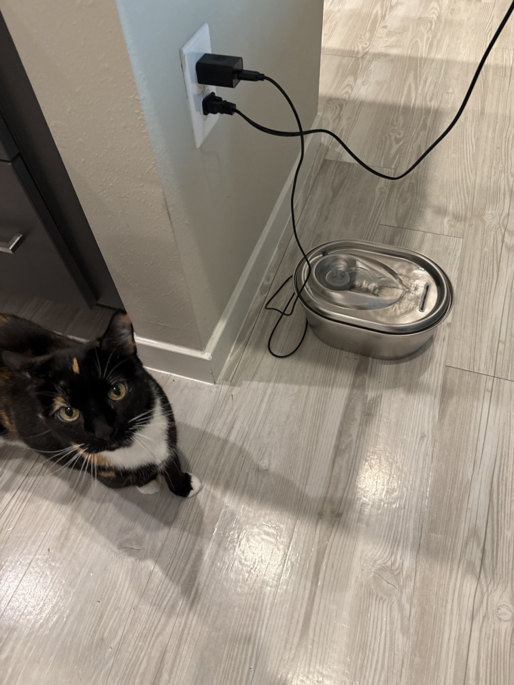

# freshwater_kitty
An Arduino-controlled fresh-water dispenser that detects a cat with a radar
sensor and opens a solenoid valve to flow water into a basin.

Dedicated to Mkit for all her love and support



## How it works

The firmware in [`src/main.cpp`](src/main.cpp) reads the radar sensor's digital
presence output and controls the valve and built-in LED together:

- At startup, the valve and LED are off.
- When the radar output goes HIGH, the valve opens and the LED turns on immediately.
- The valve stays on while the radar reports presence, with a minimum on-time of
  five seconds. Once more than five seconds have elapsed since activation, a LOW
  radar reading closes the valve and turns off the LED.

The timing uses `millis()` without blocking the main loop. The five-second interval
is measured from valve activation, not from the last detection or the start of a
LOW reading. Continuous presence keeps the valve open for a maximum of 10 seconds 
before a forced cooldown period.

Serial output at **57600 baud** reports state machine changes.

## Hardware

The [electrical schematic](docs_design/electrical.pdf) documents an Arduino Uno,
LD2410C radar sensor module, solenoid valve, MT3608 boost converter set to 12 V,
and an IRLZ44N MOSFET valve driver. The driver includes a 100 Ω gate resistor,
10 kΩ gate pulldown, and 1N4001 flyback diode; the supply includes a 470 µF capacitor.

| Connection | Arduino pin | Behavior |
| --- | --- | --- |
| Radar sensor OUT | D2 (input) | HIGH indicates presence |
| Valve driver gate, through 100 Ω resistor | D7 (output) | HIGH energizes the valve |
| Built-in LED | `LED_BUILTIN` | Mirrors the valve output |

The schematic uses a shared 5 V supply for the Arduino, radar sensor, and boost
converter input, with a common ground. The valve is powered by the 12 V boost
output and switched through the MOSFET driver.

The [physical design notes](docs_design/physical.pdf) describe the reservoir and
basin arrangement, tubing, and estimated water flow trajectory.

## Configuration

The pin assignments (`RADAR_PIN`, `SOLENOID_PIN`) are defined in `include/hardware.h`.
Serial speed is set in both `Serial.begin()` and `platformio.ini`; keep these
values matched when changing it.

## Development

The default target is an Arduino Uno (ATmega328P), using the Arduino framework
and PlatformIO's `atmelavr` platform. If your board is a different ATmega model,
change the `board` setting in `platformio.ini` to its
[PlatformIO board ID](https://docs.platformio.org/en/latest/platforms/atmelavr.html#boards).

Install the PlatformIO IDE extension for VS Code, or install
[PlatformIO Core](https://docs.platformio.org/en/latest/core/installation/index.html)
for command-line development. Run these commands from the project directory
(or the PlatformIO terminal in VS Code):

```sh
pio run                     # Build firmware
pio run --target upload     # Upload to a connected board
pio device monitor          # Open serial monitor at 57600 baud
```

PlatformIO downloads the AVR toolchain and Arduino framework on the first build.
If port detection fails, pass `--upload-port /dev/ttyACM0` when uploading or
`--port /dev/ttyACM0` when opening the monitor, using your board's actual port.

After uploading, open the serial monitor and reset the board to see the startup
message. Trigger the radar sensor and check that the valve and LED turn on
immediately. Clear the detection area and check that they turn off once the
minimum on-time has elapsed. The serial messages report each valve state change.

Project headers belong in `include/`, private libraries in `lib/`, and future
unit tests in `test/`. No automated tests are included yet.
